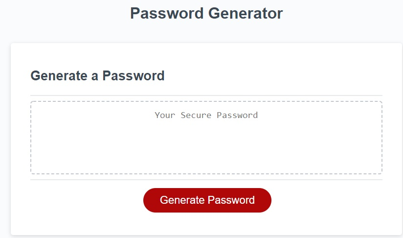

# Random Password Generator

## Installation

Navigate to the website and it will be ready to go.

## Usage

Upon page load, click on the "Generate Password"  red button. and follow the prompts to get given a password with the criteria that is chosen.
You can copy the password to your clibboard and use it however you need to.

## Credits

The HTML was provided by my bootcamp class. 
There were some starter javascript also added by my boot camp class.

I used blogs and questions from https://stackoverflow.com/, https://developer.mozilla.org/,and https://www.w3schools.com/.

Many people in the class, as well as TA's and my tutor helped me problem solve and help debug.

## License

Licensed under the MIT License

## How to Contribute

If you would like to contribute please follow the guidlines in the Contributor Covenant. You can find any information about it here. The [Contributor Covenant](https://www.contributor-covenant.org/)

